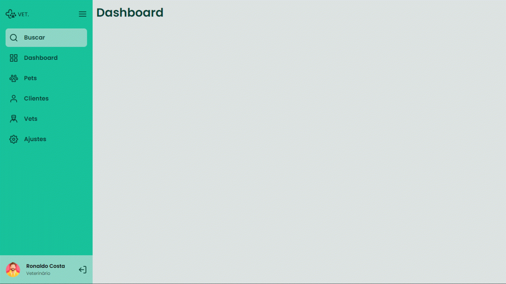

# SIDEBAR RESPONSIVE

### This project is a responsive side menu, developed in html, css and javascript, one of discover's challenges.

## Technologies

- HTML
- CSS
- JAVASCRIPT

## Websites

- Figma
- Google Fonts
- Flaticon

## View

- Run the main file ( index.html ) in the browser.

## License

This project is under the MIT license. See the [LICENSE](LICENSE) file for more details.
